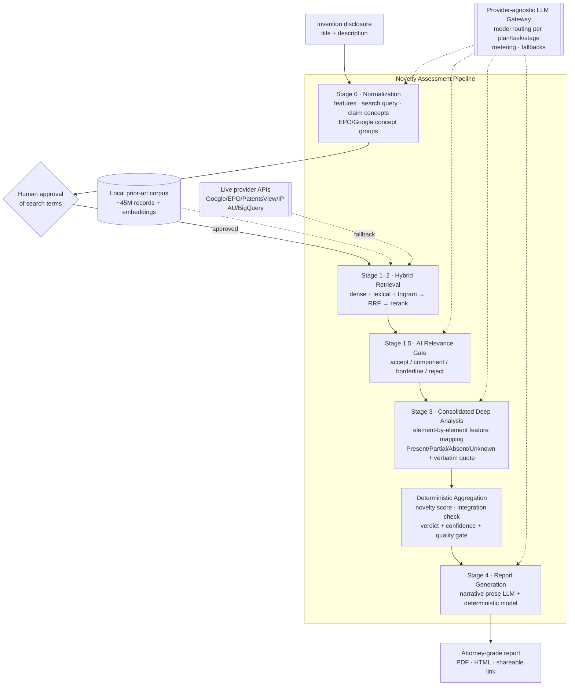

# An Intelligent Patent Novelty Assessment System Using Large Language Models: Adaptive, Evidence-Grounded, and Deterministically Adjudicated

> **Draft research paper.** Authorship, affiliation, and acknowledgements are left as placeholders for the authors to complete. This manuscript documents the design, methodology, adaptive behaviours, and reporting pipeline of a production patent‑intelligence system (internally "PatentNest") as actually implemented in the accompanying codebase. All architectural claims, thresholds, and algorithms are drawn from the implementation rather than from an idealized design.

**Authors:** _[Author 1], [Author 2], … — [Affiliation]_
**Corresponding author:** _[email]_

---

## Abstract

Determining whether an invention is *novel* (35 U.S.C. §102 / equivalent) and *non‑obvious* (§103) against the global body of prior art is a labour‑intensive, judgment‑heavy task that gates every patent filing. Large Language Models (LLMs) are attractive for this problem because they can read, paraphrase, and compare technical disclosures at scale, but they are also prone to hallucination, are difficult to audit, and cannot by themselves produce a legally defensible verdict. We present a production system for **intelligent patent novelty assessment** that resolves this tension through a deliberate separation of responsibilities: **the LLM is used only as an evidence extractor and feature‑mapper, while the novelty verdict itself is computed by a deterministic, auditable aggregation engine** that the model is explicitly forbidden to override. The system implements a multi‑phase pipeline — invention normalization and claim‑concept decomposition, hybrid dense/lexical prior‑art retrieval over a ~45‑million‑record local corpus with learned reranking, an adaptive AI relevance gate, element‑by‑element feature mapping with verbatim‑quote evidence, deterministic verdict aggregation, and attorney‑grade report generation. A layered set of **adaptive behaviours** governs how deep the system searches and analyses: a complexity‑driven depth planner, a multi‑signal early‑stopping controller with eight typed stop reasons, coverage‑saturation and marginal‑gain detection, and an operational time/token safety budget. A defensive **guardrail layer** verifies every quoted piece of evidence character‑for‑character, caps title‑only evidence, downgrades unsupported mappings, and degrades gracefully under provider failure. Model selection is provider‑agnostic and centrally governed per (plan, task, stage). We describe the full methodology, the deterministic scoring model, the adaptive decision logic, and the structure of the final reports, and we discuss the design principles — evidence grounding, determinism where the law demands auditability, and human‑in‑the‑loop control — that make LLM‑assisted novelty assessment trustworthy enough for professional use.

**Keywords:** patent novelty, prior‑art search, large language models, retrieval‑augmented generation, hybrid retrieval, claim charts, evidence grounding, hallucination mitigation, human‑in‑the‑loop, legal NLP.

---

## 1. Introduction

### 1.1 Problem

A patentability (novelty) assessment answers a deceptively simple question: *is this invention new and non‑obvious in light of everything that has been published or patented before?* In practice, answering it requires (i) reducing a free‑text invention disclosure to its essential technical features, (ii) searching tens of millions of patent and non‑patent documents across jurisdictions and languages, (iii) reading the closest results and mapping each invention feature against each reference element‑by‑element, and (iv) synthesizing an opinion about anticipation (§102) and obviousness (§103), typically expressed as a *claim chart*. This is expensive, slow, and highly dependent on searcher skill. It is also the single most consequential step before a filing decision.

### 1.2 Why LLMs — and why not LLMs alone

LLMs are naturally suited to steps (i), (iii), and the prose of (iv): they normalize messy disclosures, recognize paraphrased mechanisms across documents, and write fluent analysis. But three properties make a *naïve* "ask the LLM if it's novel" approach unacceptable in a professional setting:

1. **Hallucination.** A model may assert that a reference discloses a feature it does not, or invent supporting quotes.
2. **Non‑auditability.** A single opaque "Not Novel — confidence 0.8" output cannot be defended to an inventor, an attorney, or an examiner.
3. **Legal impermissibility.** Novelty and obviousness are legal conclusions; an automated tool that renders them as facts creates liability and false confidence.

### 1.3 Our approach and contributions

We describe a deployed system that keeps the strengths of LLMs while structurally neutralizing these failure modes. Its central design decision is **"LLM‑as‑evidence‑extractor, deterministic‑aggregator‑as‑judge":** the model maps features to references and *must attach a verbatim quote* for every positive mapping, but the novelty score, the anticipation/integration check, per‑feature uniqueness, and the final verdict are all computed by deterministic server‑side code that the model cannot contradict.

Concretely, the paper contributes:

- **A multi‑phase, resumable pipeline** for end‑to‑end novelty assessment (Sections 3–4), spanning normalization, hybrid retrieval, relevance gating, deep feature mapping, deterministic verdict aggregation, and report generation.
- **A deterministic novelty‑adjudication model** (Section 4.5) that converts LLM feature maps into an auditable verdict with an explicit "insufficient evidence" gate.
- **A layered adaptive‑control system** (Section 5): a complexity‑driven depth planner, an eight‑reason early‑stopping controller with coverage‑saturation and dual‑plateau detection, escalation logic, and an operational time/token safety budget.
- **A guardrail and anti‑hallucination layer** (Section 6): verbatim‑quote verification, title‑only evidence capping, graceful degradation, and low‑evidence hand‑backs.
- **A hybrid retrieval subsystem** (Section 4.2): dense binary‑quantized ANN + lexical cover‑density + trigram fuzzy lanes fused by Reciprocal Rank Fusion, followed by a learned cross‑encoder reranker, over a large local corpus with live‑API fallback.
- **A provider‑agnostic LLM orchestration and metering layer** (Section 7) that routes each pipeline stage to a centrally governed model.
- **An attorney‑grade reporting subsystem** (Section 8) that renders deterministic claim charts, evidence‑strength grades, reference selection, and risk signals, with legal‑conclusion language deliberately withheld.

---

## 2. Background and Related Work

**Patent novelty and obviousness.** Novelty (§102) requires that no single prior‑art reference disclose every element of a claim ("anticipation"); non‑obviousness (§103) asks whether the differences would have been obvious to a person of ordinary skill, often via a combination of references (the *Graham/KSR* framework). Practically, both are examined feature‑by‑feature, which is why *claim charts* — grids of claim elements against reference disclosures — are the lingua franca of patent analysis. Our feature‑mapping output (Section 4.4) is precisely a machine‑generated claim chart with evidence provenance.

**Automated prior‑art search.** Classical patent search combines Boolean queries over full‑text indexes, classification codes (CPC/IPC), and, more recently, semantic/dense retrieval. Public efforts such as PQAI popularized "§102‑style" semantic novelty search. Our system generalizes this to a *hybrid* retrieval stack (lexical + dense + fuzzy) with learned reranking (Section 4.2).

**Retrieval‑augmented generation (RAG) and legal NLP.** RAG grounds LLM outputs in retrieved documents to reduce hallucination. Our design goes further than typical RAG: retrieved evidence is not merely context for generation — it is the *only* admissible substrate for a mapping, every positive mapping must cite a character‑exact quote from it, and the final decision bypasses the generative model entirely.

**Dense retrieval, quantization, and fusion.** We rely on approximate nearest‑neighbour search over quantized embeddings (binary/int8 via Matryoshka‑style dimension reduction), lexical cover‑density ranking (PostgreSQL `ts_rank_cd`, a BM25‑family scoring), trigram similarity (`pg_trgm`), Reciprocal Rank Fusion (RRF) to combine ranked lists, and a cross‑encoder reranker for final ordering. These are established IR components; our contribution is their concrete composition and adaptive control for the novelty‑search task.

---

## 3. System Overview

### 3.1 Architecture at a glance

The system is a multi‑tenant web platform (Next.js/TypeScript, PostgreSQL with the `pgvector` and `pg_trgm` extensions). A novelty assessment is a long‑running job executed by a background **worker** that advances a persisted **state machine**, with a parallel **client auto‑advance** state machine that enforces the human approval gate. All LLM calls pass through a central **metering gateway** that resolves which model to use per pipeline stage.



### 3.2 Pipeline stages and their persisted state

The persisted job state machine collapses the logical stages into four checkpoints (`STAGE_0`, `STAGE_1`, `STAGE_3_5`, `STAGE_4`) with statuses `PENDING → STAGE_0_COMPLETED → STAGE_1_COMPLETED → STAGE_3_5_COMPLETED → COMPLETED` (or `FAILED`). Logical sub‑stages 1.5 (relevance gate) and 2 (discovery) execute within these checkpoints. Every stage entry is **idempotent** (guarded by "results already exist?" checks), **cancellation‑aware** (checked before and after each stage), and **resumable** from the last completed checkpoint.

| Logical stage | Purpose | LLM? | Task / stage code | Output |
|---|---|---|---|---|
| **Stage 0** — Normalization | Decompose the disclosure into atomic features, a recall‑oriented search query, claim concepts, and classification/EPO/Google keyword hints | Yes | `LLM5_NOVELTY_ASSESS` / `NOVELTY_QUERY_GENERATION` | `NormalizedIdea` (JSON) |
| **Stage 1–2** — Retrieval | Retrieve candidate prior art from the local corpus (live APIs as fallback) | Optional (query expansion) | `LLM5` / `NOVELTY_QUERY_GENERATION` (planner) | Ranked candidate set |
| **Stage 1.5** — Relevance gate | Batched AI triage of candidates into accept/component/borderline/reject | Yes | `LLM5` / `NOVELTY_RELEVANCE_SCORING` | Gated + scored candidates |
| **Stage 3 / 3.5** — Deep analysis | Element‑by‑element feature mapping with verbatim evidence; per‑reference remarks | Yes | `LLM5` / `NOVELTY_CONSOLIDATED_ANALYSIS`, `NOVELTY_COMPARISON`, `NOVELTY_FEATURE_ANALYSIS` | Feature maps + remarks |
| **Deterministic aggregation** | Compute novelty score, integration check, verdict + confidence | **No (server code)** | — | `AggregationResult` |
| **Stage 4** — Report | Attorney‑grade narrative + deterministic report model | Yes (prose only) | `LLM6_REPORT_GENERATION` / `NOVELTY_REPORT_GENERATION` | Report model → PDF/HTML |

---

## 4. Methodology

### 4.1 Stage 0 — Invention normalization and decomposition

The raw disclosure (a title and a free‑text description) is the only required input. Stage 0 prompts the model as a "patent novelty search strategist" to return a single strictly‑typed JSON object. The decomposition is richer than a flat keyword list; it captures the **structure** needed both for retrieval and for downstream claim‑level analysis:

- **`invention_features`** — 3–8 (up to 10) *atomic* technical mechanisms. The prompt enforces strict discipline: each feature must be a single technical object/mechanism/process‑step/data‑flow/material‑relationship, must *not* be a benefit ("real‑time monitoring", "improved efficiency"), and must *not* be a bare generic component (processor, sensor, polymer, antibody) unless its specific interaction is material. Features are ordered from broad core mechanisms (which retrieve the closest prior art) to narrower differentiators.
- **`feature_details`** — one row per feature with a `feature_type` ∈ {`core_technical`, `novelty_candidate`, `implementation`, `generic_weak`}, a `user_disclosure`, a `technical_role`, a source excerpt, an attorney‑style `claimable_text`, a controlled `embedding_search_text` (synonym‑expanded phrase used for dense retrieval), and a `feature_confidence`.
- **`searchQuery`** — a 12–35‑word plain‑English, *recall‑oriented* query. The prompt deliberately instructs the model to build it around the **baseline mechanism** older patents are likely to describe, and to push narrower improvements into `novelty_focus` rather than "over‑fitting" the query to the invention's newest twist — the searcher's classic recall/precision trade‑off, encoded as prompt policy.
- **`claim_concepts`** and **`novelty_focus_interactions`** — groups of cooperating features (e.g. "sensing validates actuation"), each with an importance and a "risk if missing". These drive both cluster‑coverage checks (Section 5) and the claim‑positioning report (Section 8).
- **Retrieval hints** — `cpcCodes`/`ipcCodes`, `epoTitleKeywords`/`epoAbstractKeywords`/`epoCombinedKeywords` (for EPO OPS field search), and `google_concept_groups` (2–3 groups of interchangeable phrasings that drive a Boolean `(g1 OR …) AND (g2 OR …)` Google Patents query).
- **`confidence`** and **`warnings`** — a self‑assessment of disclosure sufficiency, used downstream as a complexity signal.

This output is presented to the user, who must **approve the search terms** before the pipeline proceeds (Section 5.4). Approved edits are merged back and re‑normalized.

### 4.2 Stages 1–2 — Hybrid prior‑art retrieval

The retrieval subsystem is the primary lane over a **local corpus** (~45M Google Patents records plus a jurisdiction‑specific corpus, stored in `local_patents` with embeddings in `local_patent_embeddings`), with **live provider APIs used only when the corpus returns zero results** (cheapest‑first fallback: Google Patents (SerpApi) → EPO OPS → IP Australia → PatentsView → Google BigQuery). Every live result is persisted back into the corpus, so the corpus doubles as a durable cache and the same query re‑runs locally thereafter.

Within the corpus, `IndianCorpusProvider.search()` runs a **multi‑lane hybrid** and fuses the lanes with Reciprocal Rank Fusion (RRF):

1. **Dense / semantic (pgvector ANN).** The `searchQuery` and each feature's `embedding_search_text` are embedded and issued as *independent* ANN probes (up to `maxVectorQueries = 9`, at probe concurrency 3). Embeddings are **environment‑configurable** via `PATENT_CORPUS_EMBEDDING_MODEL`: the code default is Voyage `voyage-3.5-lite` at 512 dimensions with **binary quantization** (64 bytes/vector, Hamming `<~>` distance), and OpenAI `text-embedding-3-small` at 1536 dimensions (float, cosine `<=>`) is supported and used for some deployed corpora. Query embeddings use asymmetric `input_type=query` vs. `document` for the corpus. ANN uses an IVFFlat index (`ivfflat.probes = 24`).
2. **Lexical full‑text.** PostgreSQL `websearch_to_tsquery('english')` over a `title || abstract || rag_text` document, ranked by `ts_rank_cd` (cover‑density, a BM25‑family score).
3. **Metadata full‑text.** `simple`‑config match over classifications/inventors/applicants (weight 0.45).
4. **Structured literal‑match lane.** Implements the query contract "alternatives within a group are OR‑ed, distinct groups AND‑ed".
5. **Trigram fuzzy lane.** `pg_trgm` similarity (threshold 0.18) — engaged only if the dense/lexical lanes under‑fill the requested limit.
6. **Field/metadata filter lane.** Positive field filters (title/abstract ILIKE, classifications, dates, countries), ordered by publication date.

The final per‑result score is a weighted blend of the signals:

```
retrievalScore = 0.45·conceptSignal + 0.18·textScore + 0.12·titleScore
               + 0.05·classificationSignal + min(0.08, rrfScore)
```

Across providers, `mergeProviderResults` fuses again by RRF (`weight/(60+rank)`), gives the primary local corpus a ×1.08 weight boost, reserves the best distinct hit per source for diversity, and normalizes combined scores to `[0.01, 0.99]`. Deduplication is by a **canonical publication key** (uppercased, non‑alphanumerics stripped, *kind‑code suffix removed*), so `US1234567B1` and `US1234567A` collapse to one reference whose provenance (`sourceProviders`, `matchedFields`) is unioned.

**Learned reranking.** When enabled and an API key is present, all candidates are reranked by a cross‑encoder — Voyage `rerank-2.5-lite` (`/v1/rerank`, ≤1000 docs/call, ≤1600 chars/doc, 30 s timeout, 3 attempts) — scored against the *natural‑language* semantic query (not the lexical syntax). The reranker's `relevance_score` becomes the score of record (the fused score is retained as `preRerankRelevance`); its purpose is to **normalize scores across heterogeneous corpora** (binary/Hamming Google vs. float/cosine local) onto one comparable basis. An optional absolute score floor can drop weak candidates. On any reranker failure the pipeline keeps the fused merge order.

**Non‑patent literature (NPL).** A parallel lane queries scholarly sources (Google Scholar, Semantic Scholar, Crossref, OpenAlex, PubMed, arXiv, CORE), deduplicated by DOI (else title|year). Scholarly references flow into the same downstream feature‑mapping and are reported separately.

### 4.3 Stage 1.5 — Adaptive AI relevance gating

Retrieval optimizes recall and therefore returns many marginally‑relevant candidates. Stage 1.5 is a **batched LLM triage** (default `maxCandidates = 80`, `batchSize = 15`) that routes each candidate into one of four buckets with a calibrated score band:

| Decision | Meaning | Score band |
|---|---|---|
| `accept` | Direct invention‑level match | 0.70–1.00 |
| `component` | Component / feature‑level prior art | 0.40–0.85 |
| `borderline` | Needs review (quota‑capped to 5) | 0.20–0.45 |
| `rejected` | Remote / off‑topic | 0.00–0.25 |

The gate is not a novelty judgment — it decides *what is worth reading closely*. It applies explicit "component‑salvage" and "form‑factor/object‑target downgrade" rules and is robust to failure: a per‑batch timeout budget (≥10 s, per‑call ≥45 s) and, on any timeout/parse/LLM error, a **borderline fallback record** (score 0.2, `gate_error`) is written so a candidate is *degraded, never silently dropped*. The gate's aggregate status is `complete` / `partial` / `failed`, and gate results are cached and reused only when `complete` and the batch hash matches.

### 4.4 Stage 3 / 3.5 — Deep feature mapping (the machine claim chart)

The gated candidates enter deep analysis, whose primary path is a single **consolidated** prompt ("skeptical novelty analyst") that, for each reference in a batch, performs four tasks in one pass: (1) map **every** invention feature, (2) write per‑reference overlap remarks, (3) emit attorney‑review comparison rows placing the user's disclosure side‑by‑side with the reference, and (4) summarize cross‑set novelty signals. The mapping vocabulary is four‑valued:

- **Present** — the *same mechanism* is concretely disclosed.
- **Partial** — a related mechanism is disclosed but a required element/constraint/interaction/step is missing.
- **Absent** — the reviewed record is adequate to compare and the feature is not disclosed.
- **Unknown** — the record is too thin/vague/poorly‑translated to assess.

The prompt encodes the evidentiary discipline that makes the output defensible:

- **Verbatim evidence is mandatory.** Every Present/Partial requires a quote of ≤18 words *copied exactly, character‑for‑character* from the supplied title, abstract, or claims — no paraphrase, reorder, or translation. If no supporting quote exists, the status must be Absent or Unknown.
- **Claims outrank abstracts** as evidence when a claims excerpt is available (claims define protected scope).
- **Missing evidence is not novelty.** A feature Absent/Unknown in one reference is only a *potential* differentiator if it is absent from the *closest* references and is not a generic field‑common term.
- **Generic terms don't count** ("system", "module", "sensor"; "composition", "polymer"; "sequence", "vector") unless the full mechanism is disclosed.

Each comparison row carries a status, an `extent_score` (disclosure extent, banded: Present 0.75–1.00, Partial 0.35–0.74, Absent 0.00–0.20, Unknown 0.00–0.35), a `confidence`, and a single polished `professional_remark`. The output is, in effect, a **claim chart with per‑cell provenance**.

If the consolidated path fails after retries for a batch, a legacy chain (feature‑mapping → per‑patent remarks) runs for that batch; if *every* batch fails, the stage substitutes a deterministic all‑`Unknown` map and marks itself degraded (which, in turn, forces a conservative verdict — Section 6).

### 4.5 Deterministic novelty aggregation and verdict

This is the methodological core. The LLM's feature maps are **inputs**; the verdict is **computed**. The prompt is explicit that "the metrics decision, confidence, and novelty_score are deterministic server values — do not contradict or replace them."

**Per‑reference weighted coverage.** Each cell contributes a *mapped factor* (Present = 1.0, Partial = 0.5, Absent = 0, Unknown = excluded so that missing evidence cannot inflate apparent novelty), weighted by feature importance (`novelty_candidate` ×1.25/×2 in prioritization, `core_technical` ×1.5, generics down‑weighted). A reference's **coverage ratio** is `Σ(weight·mappedFactor)/Σweight`, and an **important‑only** coverage ratio is computed over important features alone.

**Integration (anticipation) check.** A §102‑style test: does *any single* reference map a **majority** of the invention's features (`⌊n/2⌋+1`, counting Present + Partial)? If so, that reference is flagged as an integration/anticipation risk and recorded as `integration_pn`. Additionally, `findHighMappedOverlapReference` flags a closest reference when `importantCoverage ≥ 0.65` **and** (a novelty‑candidate feature is strongly mapped **or** core coverage ≥ 0.8) — i.e. broad thematic overlap alone is not enough.

**Per‑feature uniqueness.** For each feature, a coverage gap (`absent_in / total`) and flags for "seen anywhere", "gap against closest references", and **combination‑sensitive differentiator** (present somewhere but absent from the closest references) are computed. Unknown cells never increase uniqueness.

**Novelty score and verdict.** `computeNoveltyScore` aggregates per‑feature novelty factors (closest‑ref gap seen elsewhere → 0.35; unseen gap → coverage‑gap/uniqueness; Present → 0; Partial → 0.5), weighting novelty‑candidate and critical features. `computeDecisionAndConfidence` then applies an **explicit quality gate first**:

```
if (qualityFlags.low_evidence OR patentsAnalyzed < 5):
    return { decision: "Low Evidence", confidence: "Low" }
```

i.e. **fewer than five analysed references can never yield a novelty verdict.** Otherwise the decision is:

- `Not Novel` — a high‑mapped‑overlap reference exists, or a single reference integrates a majority with dense coverage;
- `Partially Novel` — material overlap with plausible differentiators (or an override lifting `Not Novel` → `Partially Novel` when the novelty score ≥ 0.65);
- `Novel` — important‑feature score ≥ 0.7 with no anticipating reference;
- graded `Low` / `Medium` / `High` confidence (High requires ≥ 20 analysed references, no low‑evidence flag, and ≤ 25% partial‑heavy features).

The result is packaged as a `CanonicalNoveltyVerdict` with the decision, confidence, novelty score, a plain‑English summary, and the **decisive references** (the integration reference and closest mapped references). A `degraded` flag (from failed batches) forces the verdict to "Low Evidence" and a caution to re‑run.

**Why this matters.** Because the verdict is a pure function of verified feature maps, it is *reproducible*, *inspectable*, and *explainable*: one can point to exactly which references map which features with which quotes, and why the decision followed. The LLM cannot hallucinate the system into a favourable verdict.

### 4.6 Stage 4 — Report generation

Stage 4 has two layers. A **narrative LLM** (`LLM6_REPORT_GENERATION` / `NOVELTY_REPORT_GENERATION`) writes prose — executive summary, structured narrative (integration analysis / feature insights / verdict explanation), concluding remarks — *from the per‑reference remarks and the deterministic metrics*, with a deterministic fallback report if it fails and a domain‑relevance guard that discards off‑topic model output. The **report model** itself (`buildNoveltyAttorneyReportModel`) is then assembled entirely in deterministic code: claim charts, verdict grades, counts, and reference selection are computed, and the model *sanitizes* the LLM prose (Section 8). No verdict, count, or claim chart depends on the generative model.

---

## 5. Adaptive Behaviours and Decision Logic

The system layers four adaptive mechanisms so that effort scales with problem difficulty and evidence, rather than running a fixed budget every time.

### 5.1 Complexity‑driven depth planning

Before deep analysis, `adaptiveComplexityProfile` sizes the work from the invention itself and the observed art:

```
if genericRatio > 0.6:        crowded  → batchSize 8, analyse 40–60
units = importantFeatures + 2·conceptCount + (stage0.confidence < 0.7 ? 2 : 0)
if units ≤ 6:                 simple   → batchSize 4, analyse 16–24
elif units ≤ 12:              moderate → batchSize 6, analyse 24–40
else:                         complex  → batchSize 8, analyse 32–60
```

A disclosure with many cooperating claim concepts, low Stage‑0 confidence, or a crowded/generic result field is analysed more deeply; a simple, clean one is analysed less. This directly sets batch size and the minimum/maximum number of references to feature‑map.

### 5.2 Multi‑signal early stopping

`buildAdaptiveScreeningProgress` runs after each batch and selects at most one **typed stop reason** from a prioritized list:

| Stop reason | Trigger (summarized) | Completeness |
|---|---|---|
| `safe_report_due_to_qa_failure` | Degraded batch or QA‑invalidated accept, and no decisive hit | degraded |
| `high_record_overlap_candidate_confirmed` | A *decisive* reference (HIGH overlap, screening confidence ≥ 0.75, important coverage ≥ 0.90) confirmed over `confirmationBatches` | complete |
| `safety_budget_reached` | Elapsed ≥ 20 min **or** tokens ≥ 250 000 | incomplete |
| `coverage_saturation` | Coverage plateau **and** stable‑risk plateau (both ≥ 2 batches) **and** no ungated high‑tier candidates **and** clusters sufficient **and** evidence quality not low | complete |
| `candidate_pool_exhausted` | No remaining reviewable candidates and none pending | complete/incomplete |
| `provider_or_cluster_coverage_incomplete` | Ungated high‑tier candidates or uncovered critical concept clusters remain | incomplete |

Two subtleties are important. First, an operational **safety budget** (time/tokens) is reported *separately* from genuine saturation, so "we ran out of budget" is never dressed up as "we are confident it's novel". Second, saturation requires a **dual plateau** — both marginal important‑feature coverage gain (< 0.05 per batch) *and* risk‑estimate change (< 0.05) must flatten across consecutive batches — and is blocked whenever evidence quality is low or a *critical* claim‑concept cluster is still uncovered.

A policy switch governs whether these signals *act*: `off` (fixed budget), `observe` (compute signals for telemetry but never halt), and `enforce` (stop reasons are terminal; batches run sequentially so the loop can stop between them).

### 5.3 Escalation

In `enforce` mode, if the relevance gate signalled that more candidates exist and coverage is still incomplete, the pipeline **escalates**: it promotes additional high‑tier candidates, re‑runs the relevance gate on the next batch, and merges them in — bounded by the safety budget. This is the "go get more evidence before concluding" path, and it is symmetric with early stopping: the controller both *stops early* when evidence is decisive/saturated and *digs deeper* when coverage is thin.

### 5.4 Human‑in‑the‑loop checkpoints

Automation is bounded by explicit human gates:

1. **Search‑term approval (primary gate).** The client auto‑advance refuses to proceed past Stage 0 with `NEEDS_STAGE0_APPROVAL` until the user approves (or edits) the generated features and query. Resumed searches with downstream results are treated as already‑approved so they don't re‑prompt.
2. **No‑patents / low‑evidence hand‑back.** If retrieval or the gate yields nothing visible, the pipeline stops with a `NO_PATENTS` message; if fewer than five references are analysable, the verdict is "Low Evidence" with guidance to broaden the search — the system declines to guess.
3. **Idea refinement.** After results, the user can rewrite the disclosure to lead with confirmed differentiators (strictly forbidden from adding new technical facts; support gaps become open questions).
4. **Claims/drafting freeze.** When the assessment is pushed to claim drafting, its positioning is projected into an *authoritative* guidance block ("do not build the independent claim solely on any element listed under 'do not rely on these alone'").
5. **Cancellation.** A user cancel is honoured at all ~22 stage checkpoints and transactionally flips the job to cancelled.

---

## 6. Guardrails, Anti‑Hallucination, and Reliability

The verdict is only as trustworthy as the feature maps it aggregates, so a dedicated guardrail layer polices the LLM's output before it reaches aggregation.

**Verbatim‑quote verification.** `validateFeatureCellEvidence` re‑checks that every supporting quote is *actually present* (after normalization) in the reference's title/abstract/claims. If it is not, the cell is **downgraded to Unknown**, its source set to `none`, `qaDowngraded = true`, and its confidence capped at 0.4. A hallucinated quote thus cannot support a Present/Partial mapping.

**Title‑only capping.** A Present whose only support is the *title* is downgraded to Partial with `evidenceDepth = TITLE_ONLY` and legal‑evidence strength 0.30 — titles identify relevance but rarely disclose a complete mechanism. An evidence‑strength ladder (claims 0.75 > abstract 0.65 > title 0.30) makes provenance first‑class, and claims win over abstract for the same quote.

**Evidence‑quality gate.** A batch's evidence is flagged *low* when, e.g., > 40% of positive mappings are title‑only, > 30% of important‑feature mappings are Unknown, a critical feature is title‑only, or a purported high‑overlap candidate lacks an exact relationship quote. Low evidence blocks any favourable saturation stop.

**Graceful degradation.** Consolidated batches retry (×2) and, on exhaustion, fall back to a deterministic all‑`Unknown` map for that batch (marked degraded) rather than failing the run. Degraded batches propagate to `safe_report_due_to_qa_failure` and force a conservative verdict. The relevance gate retains gate‑errored candidates as low‑confidence borderline. The worker retries the whole job with capped backoff (`60 s / 5 min / 15 min`), checkpointing so a retry resumes rather than restarts.

**Anti‑boilerplate.** The report prompt forbids "No significant risks identified"; when the model omits risks, deterministic risk lines (integration/distributed‑coverage findings) are substituted.

Together these ensure a monotone safety property: **missing, weak, or fabricated evidence can only move the verdict toward caution, never toward unearned novelty.**

---

## 7. Provider‑Agnostic LLM Orchestration and Metering

Every LLM call in the pipeline flows through a central **metering gateway** (`llmGateway.executeLLMOperation`) keyed by a `(taskCode, stageCode)` pair. The gateway resolves the concrete model from the tenant's plan and the stage — a caller‑requested model is *ignored* when a stage is centrally configured — and supports a provider‑agnostic router across Anthropic (Claude), OpenAI, Google (Gemini), DeepSeek, Grok, Groq, and ZAI, with an ordered **fallback** list per stage and a system default. This has three consequences relevant to the paper:

1. **Model choice is a deployment decision, not a hard‑coded one.** "Which model runs Stage 3.5" is answered by the configuration for stage `NOVELTY_COMPARISON`, not by a literal in the code. This lets an operator route cheap stages (relevance gating) to a small fast model and expensive reasoning (deep analysis) to a stronger one, and swap providers without code changes.
2. **Cost is metered and reserved.** The gateway reserves a token budget, enforces per‑plan limits, and records actual token usage per call, feeding the operational safety budget of Section 5.2.
3. **Concurrency is bounded.** Deep analysis runs at bounded LLM concurrency (default up to 12), and in `enforce` mode drops to sequential so the early‑stopping controller can halt between batches.

The heavy stages use `LLM5_NOVELTY_ASSESS` (with distinct stage codes `NOVELTY_QUERY_GENERATION`, `NOVELTY_RELEVANCE_SCORING`, `NOVELTY_CONSOLIDATED_ANALYSIS`, `NOVELTY_COMPARISON`, `NOVELTY_FEATURE_ANALYSIS`) and reporting uses `LLM6_REPORT_GENERATION`.

---

## 8. Final Reports and Outputs

The deliverable is a **"Preliminary Novelty Assessment Report."** Its model is built deterministically and rendered as a paginated PDF (PDFKit, A4, cover page, reserved‑page clickable table of contents, bookmarks, running header/footer), an on‑screen/print HTML report, and a shareable snapshot link. Structure:

- **Executive snapshot** — an automated risk signal banner (verdict headline + colour), three fact cards (novelty risk, combination risk, main differentiator), an "attorney review focus" callout, the closest mapped citation, and a report‑basis methodology strip.
- **§1 Search overview** — objective, scope/methodology, key features, scoring legend, summary of relevant citations, component/feature‑level prior art, the **Key Feature Analysis Matrix**, and (conditionally) potential inventive‑step combinations.
- **§2 Citation analysis** — per‑reference detail cards with **claim charts**, plus relevant scholarly publications.
- **Appendices** — remaining mapped references (A) and shortlisted‑but‑unmapped citations (B).
- **§3–4 Landscape** — applicant/assignee and repeated‑inventor signals.
- **§5–6 Claim positioning** — primary/secondary claim focus, weak areas, "do not rely solely on", drafting considerations (independent/dependent/fallback claim ideas), and strategic review focus.
- **§7 Limitations and next steps.**

**Claim charts.** Each row is one invention feature × one reference: user disclosure vs. reference disclosure, a status, a supporting quote, an **evidence‑strength grade** (Strong/Moderate/Weak, computed from source, quote presence, feature–disclosure lexical overlap, and confidence), an `extent_score`, and a professional remark. Internal statuses map to public single‑letter codes for the matrix: **D** (Directly Mapped ← Present), **P** (Partially Mapped ← Partial), **N** (Not Found in Reviewed Record ← Absent), **R** (Requires Full‑Text Review ← Unknown), with re‑grading so that `R` is reserved for genuinely ambiguous cells.

**Verdict expression.** The report deliberately avoids raw legal conclusions. A deterministic risk assessment grades `noveltyRisk` and `combinationRisk` (Low/Moderate/High/Needs Review) from single‑reference and distributed core coverage; a language‑sanitization layer rewrites examiner‑style terms ("not novel" → "high mapped‑overlap risk", "anticipated by" → "shows high mapped overlap with", "patentable" → "potential novelty space"), and the legal conclusion field is explicitly *"Not provided; requires review."* The report is labelled a preliminary, non‑legal‑opinion analysis throughout.

**Reference selection.** A deterministic, versioned selector splits candidates into *main* (up to 10, minimum 3, protecting decisive/high‑overlap references first, then ranked fill), *mapped supplementary* (Appendix A), and *unmapped supplementary* (Appendix B, capped at 20). Ranking uses priority class (Critical > High > Medium > Low), coverage, and gate score. A persisted selection is re‑validated against current candidates and recomputed if stale.

**Counts and provenance.** The report reports how many records were retrieved/ranked, screened, direct/component/borderline matched, and deep‑mapped, and hydrates each cited reference with bibliographic metadata (applicants, inventors, classifications, filing/publication dates, jurisdiction) from the local corpus. Coverage per reference is `(present + 0.5·partial)/features`.

**Downstream handoff.** The assessment can be pushed to a claim‑drafting module, where its positioning becomes authoritative guidance, and citations are re‑ranked by threat then coverage for human claim review.

---

## 9. Implementation Notes

The system is implemented in TypeScript on Next.js with a PostgreSQL data layer (`pgvector` for ANN, `pg_trgm` for fuzzy match, GIN/IVFFlat indexes, per‑statement timeouts and `ivfflat.probes` tuning). Long‑running assessments execute in a polling background worker with lease‑based locking, heartbeats, optimistic job claiming, capped‑backoff retries, and email notification on completion. Embeddings are produced by a separate batch worker that content‑addresses embedding rows by `(patent, model, text‑hash)` to avoid re‑embedding. LLM access is centralized through the metering gateway (Section 7). The novelty‑search service alone is ~11.7k lines, reflecting the density of guardrail and adaptive logic around a comparatively small amount of prompting.

---

## 10. Discussion

Three design principles emerge, each a direct response to a way LLM systems fail in high‑stakes domains.

**Determinism where the law demands auditability.** The single most important decision is that the LLM never renders the verdict. By confining the model to evidence extraction and mapping — with mandatory verbatim quotes — and computing the verdict in transparent code, the system gains reproducibility and explainability that a purely generative approach cannot. Every conclusion traces to specific cells, quotes, and thresholds.

**Evidence grounding as an invariant, not a suggestion.** RAG typically *encourages* grounding; here it is *enforced*. Quotes are re‑verified character‑for‑character; title‑only support is capped; generic matches are rejected; unknown evidence is excluded from novelty. The net effect is a safety monotonicity: uncertainty always pushes the verdict toward caution.

**Adaptivity bounded by budgets and humans.** Effort scales with difficulty (complexity planning), stops when evidence is decisive or genuinely saturated (dual‑plateau detection), digs deeper when coverage is thin (escalation), and is fenced by a time/token budget reported honestly as "incomplete" rather than disguised as confidence. Around all of it sit human gates — approval, refinement, and a drafting freeze — so the tool augments rather than replaces professional judgment.

---

## 11. Limitations and Threats to Validity

- **Preliminary, not legal.** The output is explicitly a preliminary screen. It reasons primarily over titles, abstracts, and (when available) claims; full‑text and file‑wrapper review remain necessary, and the report says so.
- **Retrieval ceiling.** Novelty conclusions are bounded by what retrieval surfaces. A reference absent from the corpus and missed by fallback APIs cannot be mapped. The lexical lane is cover‑density (`ts_rank_cd`), a BM25‑*family* score, not Lucene BM25; classification‑based recall depends on the quality of the Stage‑0 CPC/IPC hints.
- **Language and translation.** Non‑English and machine‑translated records are more likely to be scored `Unknown`, which conservatively lowers confidence but can under‑count genuine anticipation.
- **Extraction dependence.** The verdict is deterministic *given* the feature maps, but those maps are LLM‑produced; systematic model bias (e.g. over‑calling Partial) would propagate, which the guardrails mitigate but cannot fully eliminate.
- **Obviousness is heuristic.** §103 combination risk is approximated via distributed coverage and reference‑pair union coverage; it is a *signal for review*, not a *Graham/KSR* legal analysis.
- **No gold‑standard evaluation is reported here.** This paper documents design and methodology. A quantitative evaluation — precision/recall of retrieval against examiner citations, agreement of the deterministic verdict with attorney judgments, and hallucination rates before/after the guardrail layer — is future work (Section 12).

---

## 12. Conclusion and Future Work

We described a production system for LLM‑assisted patent novelty assessment built on a single unifying idea: **use the language model for what it is good at — reading, mapping, and articulating evidence — and never for the thing it cannot be trusted to do — rendering an auditable legal verdict.** Around that idea we assembled a hybrid retrieval stack over a large local corpus, an adaptive relevance gate and depth controller, a verbatim‑grounded feature‑mapping stage, a deterministic and explainable adjudication engine, a defensive guardrail layer, and an attorney‑grade reporting subsystem, all orchestrated over a provider‑agnostic, metered LLM layer with explicit human‑in‑the‑loop gates.

Future work includes: (1) a rigorous evaluation against examiner‑cited prior art and attorney‑authored opinions, with ablations isolating the contribution of the guardrail and reranking layers; (2) tighter §103 modelling (motivation‑to‑combine reasoning grounded in the references); (3) active‑learning from attorney edits to the claim charts; (4) multilingual full‑text mapping to reduce `Unknown` rates; and (5) calibration of the deterministic thresholds against labelled outcomes.

---

## Appendix A — Key parameters (as implemented)

| Component | Parameter | Value |
|---|---|---|
| Relevance gate | max candidates / batch size / borderline quota | 80 / 15 / 5 |
| Gate score bands | accept / component / borderline / reject | 0.70–1.00 / 0.40–0.85 / 0.20–0.45 / 0.00–0.25 |
| Deep analysis | batch size / min–max references | 4–8 / 16–60 (complexity‑dependent) |
| Feature mapping | evidence quote cap | ≤ 18 words, verbatim |
| Extent score bands | Present / Partial / Absent / Unknown | 0.75–1.00 / 0.35–0.74 / 0.00–0.20 / 0.00–0.35 |
| Aggregation | mapped factor | Present 1.0 / Partial 0.5 / Absent 0 / Unknown excluded |
| Aggregation | quality gate | `low_evidence` OR `< 5` analysed ⇒ "Low Evidence" |
| Aggregation | integration threshold | majority = ⌊n/2⌋ + 1 (Present+Partial) |
| Aggregation | high‑overlap flag | important coverage ≥ 0.65 AND (novelty mapped OR core ≥ 0.8) |
| Verdict | Novel / Partially Novel thresholds | important score ≥ 0.7 / ≥ 0.35; override to Partially Novel if novelty ≥ 0.65 |
| Confidence | High requires | ≥ 20 analysed, not low‑evidence, ≤ 25% partial‑heavy |
| Adaptive | saturation plateau / marginal gain / risk delta | 2 batches / < 0.05 / < 0.05 |
| Adaptive | safety budget | 20 min OR 250,000 tokens |
| Evidence strength ladder | claims / abstract / title | 0.75 / 0.65 / 0.30 |
| Retrieval | dense model (default) | Voyage `voyage-3.5-lite`, 512‑dim binary (Hamming) |
| Retrieval | dense model (alt.) | OpenAI `text-embedding-3-small`, 1536‑dim float (cosine) |
| Retrieval | reranker | Voyage `rerank-2.5-lite` (≤1000 docs, ≤1600 chars, 30 s, 3 tries) |
| Retrieval | fusion | RRF `weight/(60+rank)`; local corpus ×1.08 |
| Retrieval | score blend | 0.45 concept + 0.18 text + 0.12 title + 0.05 class + ≤0.08 rrf |
| Report | main / min / unmapped‑supplementary refs | 10 / 3 / ≤ 20 |
| Worker | retry backoff | 60 s / 5 min / 15 min |

## Appendix B — Stage → task/stage code map

| Logical stage | Task code | Stage code |
|---|---|---|
| Stage 0 normalization / query generation | `LLM5_NOVELTY_ASSESS` | `NOVELTY_QUERY_GENERATION` |
| Stage 1.5 relevance gate | `LLM5_NOVELTY_ASSESS` | `NOVELTY_RELEVANCE_SCORING` |
| Stage 3 consolidated deep analysis | `LLM5_NOVELTY_ASSESS` | `NOVELTY_CONSOLIDATED_ANALYSIS` |
| Stage 3.5 feature mapping / comparison | `LLM5_NOVELTY_ASSESS` | `NOVELTY_COMPARISON`, `NOVELTY_FEATURE_ANALYSIS` |
| Stage 4 report narrative | `LLM6_REPORT_GENERATION` | `NOVELTY_REPORT_GENERATION` |
| (Legacy) screening / detailed assessment | `LLM4_NOVELTY_SCREEN` / `LLM5_NOVELTY_ASSESS` | `NOVELTY_RELEVANCE_SCORING` / `NOVELTY_COMPARISON` |

---

## References

_(Representative references for the camera‑ready; complete and format per venue.)_

1. 35 U.S.C. §102 (Novelty) and §103 (Non‑obvious subject matter); USPTO *Manual of Patent Examining Procedure* (MPEP), Ch. 2100.
2. *Graham v. John Deere Co.*, 383 U.S. 1 (1966); *KSR Int'l Co. v. Teleflex Inc.*, 550 U.S. 398 (2007).
3. S. Robertson and H. Zaragoza. "The Probabilistic Relevance Framework: BM25 and Beyond." *Foundations and Trends in IR*, 2009.
4. V. Karpukhin et al. "Dense Passage Retrieval for Open‑Domain Question Answering." *EMNLP*, 2020.
5. G. V. Cormack, C. L. A. Clarke, and S. Büttcher. "Reciprocal Rank Fusion Outperforms Condorcet and Individual Rank Learning Methods." *SIGIR*, 2009.
6. P. Lewis et al. "Retrieval‑Augmented Generation for Knowledge‑Intensive NLP Tasks." *NeurIPS*, 2020.
7. N. Reimers and I. Gurevych. "Sentence‑BERT: Sentence Embeddings using Siamese BERT‑Networks." *EMNLP*, 2019.
8. A. Kusupati et al. "Matryoshka Representation Learning." *NeurIPS*, 2022.
9. J. Johnson, M. Douze, and H. Jégou. "Billion‑scale Similarity Search with GPUs." *IEEE Trans. Big Data*, 2019.
10. pgvector: Open‑source vector similarity search for PostgreSQL. (Software.)
11. Project PQAI: Patent Quality through Artificial Intelligence — open patent‑search tooling. (Software/organization.)
12. J. Risch and R. Krestel. "Domain‑specific word embeddings for patent classification." *Data & Knowledge Engineering*, 2019.
13. L. Huang et al. "A Survey on Hallucination in Large Language Models." *ACM Computing Surveys*, 2024.
14. European Patent Office. *Open Patent Services (OPS) 3.2* Reference Guide. (Technical documentation.)

---

*Manuscript status: draft generated from the implemented system. Figures beyond the pipeline diagram, a formal evaluation, and venue‑specific formatting remain to be added by the authors.*
